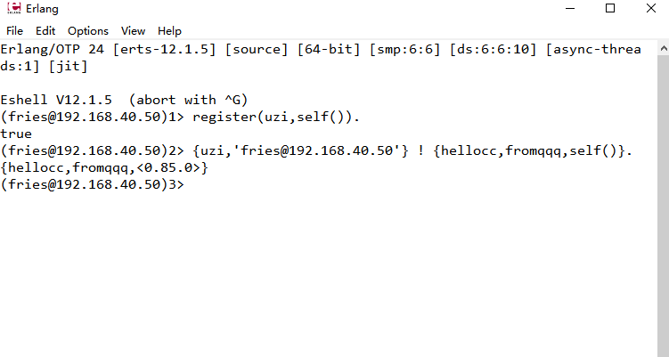
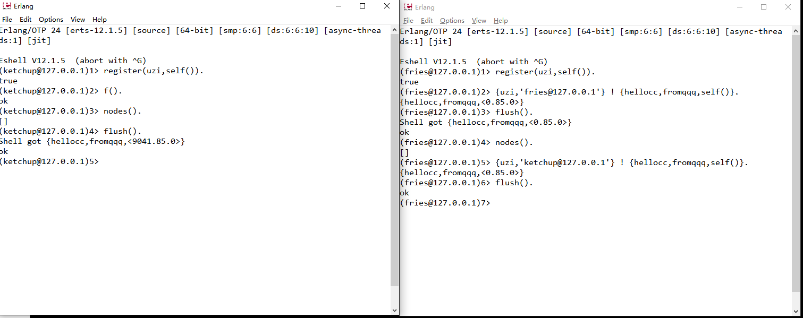
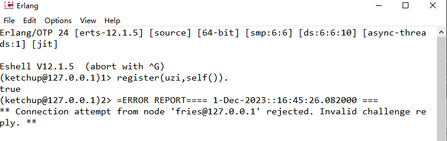
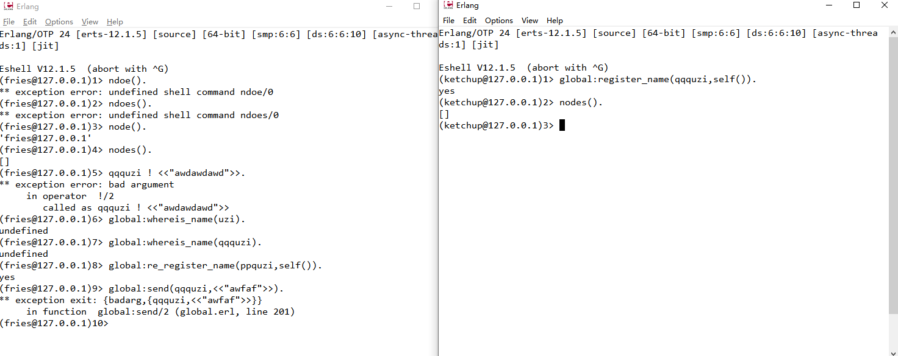

# 概述

erlang node study

<!--more-->

## 本地注册
werl -name 'fries@127.0.0.1'

之前的版本需要加''现在加了会直接报错

werl -name fries@127.0.0.1

werl -name ketchup@127.0.0.1

### 1不连接 直接给在本地注册名字的节点发消息 
此时两个节点的cookie是一样的
erlang:get_cookie().
register(uzi,self()).
fries 下执行
{uzi,'fries@127.0.0.1'} ! {hellocc,fromqqq,self()}.
可以收到消息

给K节点发
{uzi,'ketchup@127.0.0.1'} ! {hellocc,fromqqq,self()}.

也可以收到消息

### 2连接后直接给在本地注册名字的节点发消息 这个就不试了 
此时两个节点的cookie是一样的
因为发送完消息以后就 连接在一起了，个人猜测在发消息之前节点自动执行了
net_adm:ping('fries@127.0.0.1').

### 3cookie不一样会怎么样

werl -name fries@127.0.0.1 -setcookie 'awdwad223'

werl -name ketchup@127.0.0.1 -setcookie 'awdwaq773'

失败了

F节点试图连接K节点被拒绝了

## global注册

所有的操作都需要两个节点连在一起

